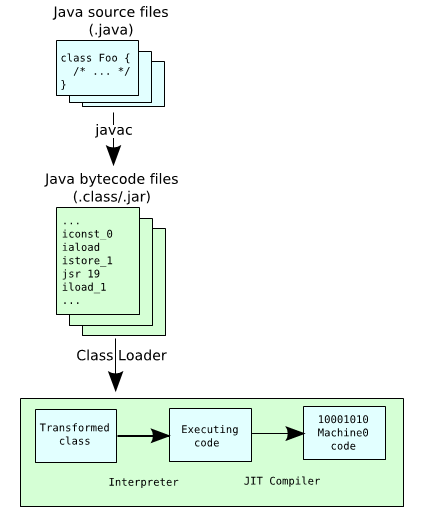
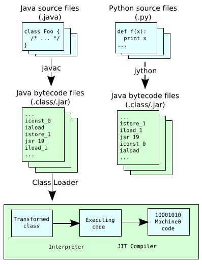

!SLIDE subsection
.notes Section about the Java Language & Platform in Java 7.
# The Language & Platform #

!SLIDE bullets incremental transition=fade
.notes The Java language.

# Java Language
* Statically typed
* OO
* Human-readable

!SLIDE bullets incremental transition=fade
.notes The Java Platform.

# Java Platform
* Runtime environment
* Links & Executes code
* Non Human-readable

!SLIDE incremental transition=fade
.notes The Java System Specs.

# Governing Specifications
* Language
	* Java Language Specification (JLS)
* Platform
	* Java VM Specification (VMSpec)
	
!SLIDE bullets incremental transition=fade
.notes Java 7 specs.

# As of Java 7

they posses no references to each other

!SLIDE center incremental transition=fade
.notes Java 7 specs meaning.

# non-Java source languages are taken seriously

!SLIDE incremental transition=fade
.notes Java 7 specs connection.

# But hang on..
How do they link together?

!SLIDE center incremental transition=fade
.notes Shared classfile format definition 1.

# Shared classfile format

!SLIDE center incremental transition=fade
.notes Shared classfile format definition 2.

# Shared classfile format

!SLIDE bullets incremental transition=fade
.notes Test

# JVM Improvements

* The DaVinci Machine project
* InvokeDynamic bytecode
* Garbage-first collector
* Performance enhancements