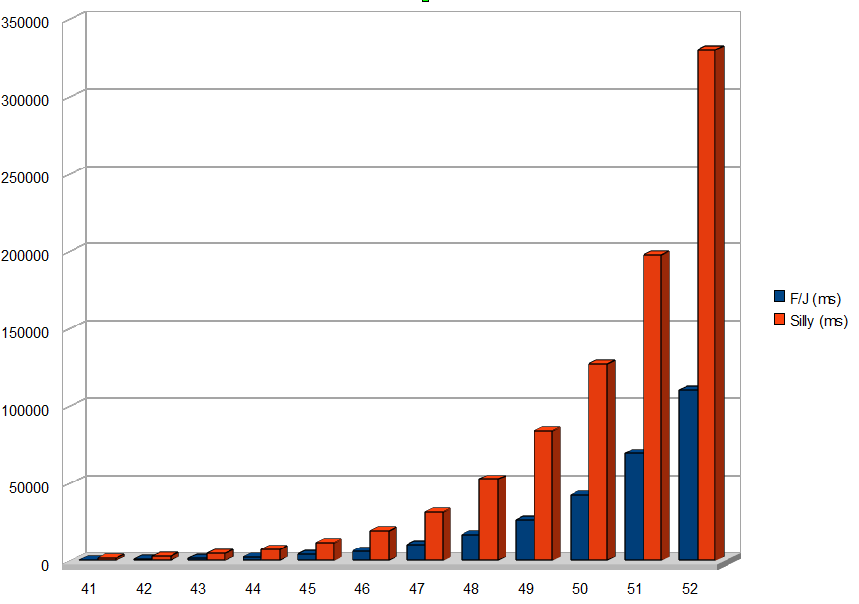
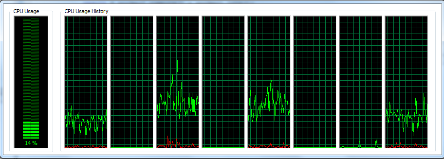
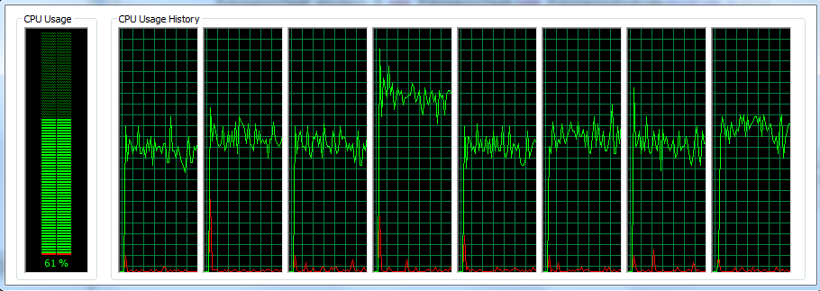

!SLIDE subsection transition=fade
.notes Section about the new concurrency packages.
# New Concurrency API #

!SLIDE bullets transition=fade
.notes What about the new Concurrency packages.

# What's New?

* Fork/Join Framework
* TransferQueue<E>
* ThreadLocalRandom

!SLIDE transition=fade
.notes The Fork/Join Framework

#Fork/Join Framework

Parralel divide-and-conquer

	@@@ java
	Result doWork(Work work) {
    if (work is small) {
        process the work
    }
    else {
        split up work
        invoke framework to solve both parts
    }

!SLIDE smaller transition=fade
.notes Example 1

	@@@ java
	public class IncrementTask extends RecursiveAction {
	private final long[] array;
   	private final int low, high;

   	public IncrementTask(long[] array, int low, int high) {
    	super();
      	this.array = array;
      	this.low = low;
      	this.high= high;
   	}

   	protected void compute() {
      	if (high - low < 5000) {
           	for (int i = low; i < high; ++i){
              	array[i]++;
           	}
        } else {
           	int mid = (low + high) >>> 1;
           	invokeAll(new IncrementTask(array, low, mid), 
				new IncrementTask(array, mid, high));
      	}
   	}}

!SLIDE small transition=fade
.notes Example 1.1

	@@@ java
	RecursiveAction mainTask =
		new IncrementTask (anArray, 0, anArray.length);
	ForkJoinPool mainPool = new ForkJoinPool();
	mainPool.invoke(mainTask);

# = Runs a task without return value.

!SLIDE smaller transition=fade
.notes Example 2

	@@@ java
	public class SumTask extends RecursiveTask {
	private final long[] array;
	private final int low, high;

	public SumTask(long[] array, int low, int high) {
		super();
		this.array = array;
		this.low = low;
		this.high= high;
	}

	protected Long compute() {
		if (high - low < 5000) {
			long sum = 0;
			for (int i = low; i < high; ++i){
				sum += array[i];
			}
		return sum;
		} else {
        	int mid = (low + high) >>> 1;
          	RecursiveTask left = new SumTask(array, low, mid);
          	RecursiveTask right = new SumTask(array, mid, high);
          	right.fork();
          	return left.compute() + right.join();
		}
	}}

!SLIDE small transition=fade
.notes Example 2.1

	@@@ java
	RecursiveTask sumTask = 
		new SumTask(anArray, 0, anArray.length);
	ForkJoinPool mainPool = new ForkJoinPool();
	Long sum = mainPool.invoke(sumTask);

# = Runs task with return value.

!SLIDE center transition=fade
.notes Statistics from fibonacci numbers a.

!SLIDE center transition=fade
.notes Statistics from fibonacci numbers b.

!SLIDE transition=fade
.notes TransferQueue?.

# TransferQueue

* Blocking queue for producers/consumers
* Producers can await receipt consumers

!SLIDE smaller transition=fade
.notes TransferQueue example.

# TransferQueue Example

	@@@ java
	TransferQueue<String> transfer =
		new LinkedTransferQueue<String>();
	transfer.transfer("Hello"); //Wait for a consumer

	if(transfer.tryTransfer("World")){
	//Don't wait for a consumer
    //The element has been transfered to a consumer
	} else {
    //There were no waiting consumer.
	//The element has not been enqueued.
	}

	boolean transfered = transfer.tryTransfer("Goodbye",
		5, TimeUnit.SECONDS);

	while(transfer.hasWaitingConsumer()){
    //There is at least one consumer waiting for a transfer
	}

!SLIDE transition=fade
.notes ThreadLocalRandom?.

# ThreadLocalRandom

* Random generator
* Isolated, not shared between threads